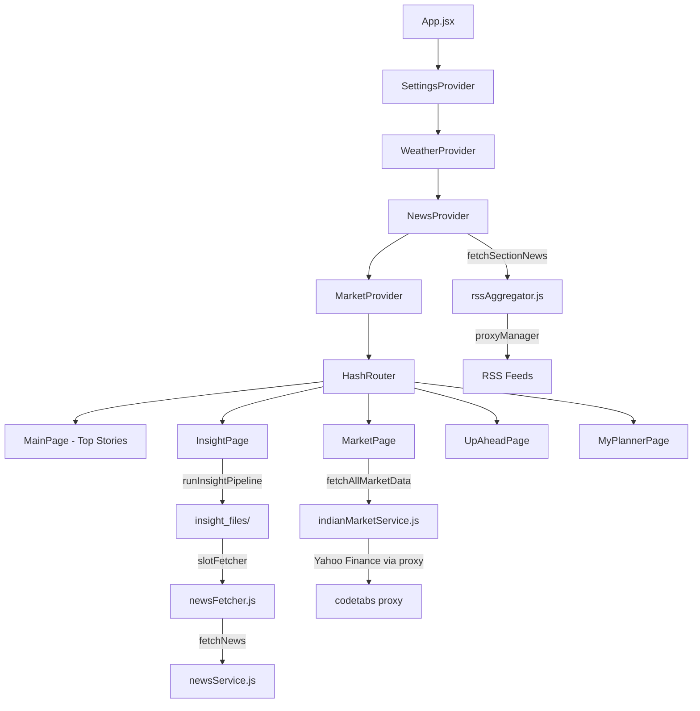

# NWv-7 Comprehensive Audit Report
## For Multi-Agent Delegation

> [!IMPORTANT]
> This audit identifies **every critical bug, architecture flaw, and UI gap** across the three broken modules (Top Stories, Market, Planner) plus the broken Insight integration. Each finding includes **root cause**, **severity**, **exact file + line**, and **copy-paste fix snippets** suitable for low-skill agents.

> [!WARNING]
> **Deployment constraint: Static GitHub Pages ONLY.** The app runs at `*.github.io` — there is no backend server. All fixes must be **client-side JavaScript** using CORS proxies, browser APIs, and RSS feeds. The codebase already has `runtimeCapabilities.js` that detects `github.io` and gates features via `isStaticHost`. Any solution requiring a Node server, Python backend, or server-side API route is invalid.

---

## Table of Contents

1. [Architecture Overview](#1-architecture-overview)
2. [MODULE A: Top Stories — Critical Bugs](#2-module-a-top-stories)
3. [MODULE B: Market — Why It Never Works](#3-module-b-market)
4. [MODULE C: Planner / Up Ahead — Broken Fetching](#4-module-c-planner--up-ahead)
5. [MODULE D: Insight — Regression After Integration](#5-module-d-insight)
6. [MODULE E: Settings Confusion](#6-module-e-settings)
7. [MODULE F: UI Revamp — Mobile View](#7-module-f-ui-revamp)
8. [Agent Task Cards](#8-agent-task-cards)
9. [QC Checklist](#9-qc-checklist)

---

## 1. Architecture Overview



> [!CAUTION]
> The app has **6 context providers nested** — Market eagerly loads on mount even when user is on Main page, causing unnecessary API calls and CORS failures that flood the console.

---

## 2. MODULE A: Top Stories — Critical Bugs

### Bug A1: "Top Stories shows random BBC world news, not actual top stories"

**Root Cause:** The `frontPage` composition uses ALL fetched articles from ALL sections, not just genuinely "top" stories.

**File:** [NewsContext.jsx](file:///c:/Code3/NWv-7/src/context/NewsContext.jsx#L131-L148)

```javascript
// LINE 133: This grabs EVERYTHING — world, india, chennai, trichy, local, etc.
const allCurrentArticles = Object.values(redistributed).flat();
// LINE 142: Then composes a "front page" from this soup
const frontPage = composeBalancedFeed(allCurrentArticles, 20, ...);
```

**Problem:** `composeBalancedFeed` tries to balance by topic/geo diversity, but since the `world` section feeds include `BBC Top Stories` (line 40 of rssAggregator.js) which is BBC's **general** feed (not filtered for importance), random BBC articles like "Grammy Awards" or "How to watch" rank alongside actual breaking news.

**File:** [rssAggregator.js](file:///c:/Code3/NWv-7/src/services/rssAggregator.js#L38-L44)
```javascript
world: [
    GOOGLE_FEEDS.WORLD_IN,
    "https://feeds.bbci.co.uk/news/rss.xml", // ← BBC TOP STORIES = general feed, NOT curated "top"
    "https://feeds.bbci.co.uk/news/world/rss.xml",
    ...
]
```

**Fix (for Agent):**

```javascript
// In frontPageComposer.js — composeBalancedFeed()
// ADD a minimum impactScore threshold before including in frontPage:
function composeBalancedFeed(articles, maxCount, maxTopicPct, maxGeoPct) {
    // NEW: Filter out low-impact filler before composing
    const MIN_IMPACT_FOR_FRONT_PAGE = 3.0;
    const qualified = articles.filter(a => (a.impactScore || 0) >= MIN_IMPACT_FOR_FRONT_PAGE);
    // If not enough qualified, fall back to top-scored from full list
    const pool = qualified.length >= 5 ? qualified : 
        [...articles].sort((a,b) => (b.impactScore||0) - (a.impactScore||0)).slice(0, maxCount);
    // ... rest of composition logic
}
```

### Bug A2: Section classifier moves stories between sections incorrectly

**File:** [sectionClassifier.js](file:///c:/Code3/NWv-7/src/utils/sectionClassifier.js) — The `classifySection` function in rssAggregator `normalizeItem` (line 652) can reclassify a "world" BBC article as "entertainment" or "business" based on keyword matching, removing it from world and placing it somewhere unexpected.

**Fix:** Section classification should be additive (tag), not destructive (move).

```javascript
// In rssAggregator.js normalizeItem(), line 654:
// BEFORE:
const finalSection = detectedSection || section;
// AFTER — only reclassify if confidence is high AND original section is 'general':
const finalSection = (section === 'general' && detectedSection) ? detectedSection : section;
```

### Bug A3: Deduplication too aggressive — removes legitimate related stories

**File:** [similarity.js](file:///c:/Code3/NWv-7/src/utils/similarity.js) — `deduplicateAndCluster` with default threshold `0.75` is too loose for title-only comparison, causing unrelated stories with common words to be merged.

---

## 3. MODULE B: Market — Why It Never Works

### Bug B1: CORS blocking on Yahoo Finance API (FATAL)

**File:** [indianMarketService.js](file:///c:/Code3/NWv-7/src/services/indianMarketService.js#L6-L7)

```javascript
const YAHOO_BASE = 'https://query1.finance.yahoo.com/v8/finance/chart/';
const PROXIES = [(url) => `https://api.codetabs.com/v1/proxy?quest=${encodeURIComponent(url)}`];
```

**Root Cause:** 
1. Yahoo Finance API blocks browser requests (CORS)
2. The single proxy `api.codetabs.com` has **severe rate limits** (100 req/day free tier) and frequently returns 429/503
3. When proxy fails, ALL market data returns empty arrays
4. No retry with alternative proxies

**Fix (for Agent):**

```javascript
// Replace PROXIES array with multiple fallbacks:
const PROXIES = [
    (url) => `https://api.allorigins.win/raw?url=${encodeURIComponent(url)}`,
    (url) => `https://corsproxy.io/?${encodeURIComponent(url)}`,
    (url) => `https://api.codetabs.com/v1/proxy?quest=${encodeURIComponent(url)}`,
    (url) => `https://cors-anywhere.herokuapp.com/${url}`,
];
```

### Bug B2: Commodities, Currency, FII/DII always empty on static host

**File:** [indianMarketService.js](file:///c:/Code3/NWv-7/src/services/indianMarketService.js#L151-L174)

```javascript
export async function fetchCommodities() {
    const snapshot = await fetchStaticSnapshot(); // ← tries /data/market_snapshot.json
    if (snapshot?.commodities?.length) return snapshot.commodities;
    return []; // ← ALWAYS returns empty because snapshot.json doesn't exist
}
```

**Root Cause:** These functions ONLY read from a static snapshot JSON file that must be pre-generated by a backend script. On GitHub Pages (static host), this file doesn't exist, so commodities, currencies, and FII/DII are **always empty**.

**Fix:** Add Yahoo Finance fallback for commodities:

```javascript
export async function fetchCommodities() {
    const snapshot = await fetchStaticSnapshot();
    if (snapshot?.commodities?.length) return snapshot.commodities;
    
    // NEW: Fallback to Yahoo Finance for key commodities
    const COMMODITY_SYMBOLS = [
        { symbol: 'GC=F', name: 'Gold', unit: '$/oz' },
        { symbol: 'SI=F', name: 'Silver', unit: '$/oz' },
        { symbol: 'CL=F', name: 'Crude Oil', unit: '$/bbl' },
    ];
    const results = await Promise.allSettled(
        COMMODITY_SYMBOLS.map(async (c) => {
            const data = await fetchYahooData(c.symbol, { range: '5d', interval: '1d' });
            const price = extractYahooPrice(data);
            if (!price) return null;
            return {
                name: c.name, unit: c.unit,
                value: `$${price.price.toFixed(2)}`,
                changePercent: price.changePercent,
                direction: price.change >= 0 ? 'up' : 'down'
            };
        })
    );
    return results.filter(r => r.status === 'fulfilled' && r.value).map(r => r.value);
}
```

### Bug B3: IPO data disabled on static host

**File:** [indianMarketService.js](file:///c:/Code3/NWv-7/src/services/indianMarketService.js#L105)

```javascript
export async function fetchIPOData() {
    if (isStaticHostRuntime()) { 
        return { upcoming: [], live: [], recent: [], source: 'static-host-disabled' }; 
    }
    // ... scraping logic that only works with a backend proxy
}
```

IPO scraping requires server-side HTML parsing. On GitHub Pages this is intentionally disabled but shows an empty card with no explanation.

### Bug B4: MarketContext loads eagerly regardless of which page user is on

**File:** [MarketContext.jsx](file:///c:/Code3/NWv-7/src/context/MarketContext.jsx#L95-L97)

```javascript
useEffect(() => {
    loadMarketData(); // ← fires on mount, even if user is on Main page
}, [loadMarketData]);
```

**Fix:** Make market loading lazy — only fetch when MarketPage is visited:

```javascript
// In MarketContext.jsx:
const [initialized, setInitialized] = useState(false);

const ensureBoot = useCallback(() => {
    if (!initialized) {
        setInitialized(true);
        loadMarketData();
    }
}, [initialized, loadMarketData]);

// Remove the auto-load useEffect
// In MarketPage.jsx, add:
useEffect(() => { ensureBoot(); }, [ensureBoot]);
```

### Bug B5: No Insight or Market in Bottom Nav

**File:** [BottomNav.jsx](file:///c:/Code3/NWv-7/src/components/BottomNav.jsx#L9-L15)

```javascript
const navItems = [
    { path: '/', label: 'Main', icon: '🏠' },
    { path: '/up-ahead', label: 'Up Ahead', icon: '🗓️' },
    { path: '/my-planner', label: 'Planner', icon: '📌' },
    { path: '/following', label: 'Follow', icon: '🧭' },
    { path: '/more', label: 'More', icon: '⋯' }
];
// ❌ No Market, no Insight! User can't navigate to them from mobile.
```

**Fix:** Replace nav items to match your wish page (5-tab: Main, Insight, Up Ahead, Planner, Market):

```javascript
const navItems = [
    { path: '/', label: 'Main', icon: '🏠' },
    { path: '/insight', label: 'Insight', icon: '📊' },
    { path: '/up-ahead', label: 'Up Ahead', icon: '🗓️' },
    { path: '/my-planner', label: 'Planner', icon: '📌' },
    { path: '/markets', label: 'Market', icon: '📈' },
];
```

> [!WARNING]
> There is **no route for `/insight`** in App.jsx! The InsightPage component exists but it's not wired into the router. This must be added.

**Fix in App.jsx** (add after line 100):
```jsx
<Route path="/insight" element={<InsightPage />} />
```

---

## 4. MODULE C: Planner / Up Ahead — Broken Fetching

### Bug C1: Up Ahead fetches generic search results, not real events/alerts

**File:** [upAheadService.js](file:///c:/Code3/NWv-7/src/services/upAheadService.js) — The service fetches from Google News RSS with search queries like "upcoming movies India" or "shopping deals". These return **news articles about events**, not structured event data.

**Consequence:** Results are generic news articles, not actionable alerts/offers with dates, prices, or location info. The "date-aware, location-aware" promise is not fulfilled because RSS doesn't provide structured event metadata.

### Bug C2: Planner settings confusion — "does it pick from respective or main app?"

**File:** [SettingsPage.jsx](file:///c:/Code3/NWv-7/src/pages/SettingsPage.jsx) — At 74KB, this is the largest file in the project. Settings for Up Ahead keywords live in `settings.upAhead.keywords` but the fetcher reads from `settings_upahead.js` config which has its own defaults.

**Root Cause:** Two separate config sources:
1. `src/config/settings_upahead.js` — hardcoded default keywords
2. `localStorage 'dailyEventAI_settings'` → `settings.upAhead.keywords` — user overrides

The fetcher should merge both, but often only reads one.

### Bug C3: Planner has no data pipeline — it only stores what user manually adds

**File:** [MyPlannerPage.jsx](file:///c:/Code3/NWv-7/src/pages/MyPlannerPage.jsx#L99-L103)

```javascript
const loadPlan = () => {
    if (plannerStorage.getPlan) {
        setPlanData(plannerStorage.getPlan()); // ← only reads from localStorage
    }
};
```

The Planner is a **passive display** of manually-added items from Up Ahead. It doesn't independently fetch alerts, offers, or events. If Up Ahead fails to fetch (which it often does), the planner stays empty.

---

## 5. MODULE D: Insight — Regression After Integration

### Bug D1: Embeddings are fake — clustering produces garbage

**File:** [embeddingsAdapter.js](file:///c:/Code3/NWv-7/src/adapters/embeddingsAdapter.js)

```javascript
export async function getEmbeddings(texts) {
    return texts.map(text => {
        const vec = new Array(384).fill(0);
        if (text && text.length > 0) {
            vec[0] = text.length / 1000;  // ← ONLY uses string length
            vec[1] = text.charCodeAt(0) / 255;  // ← and first character
        }
        return vec;
    });
}
```

> [!CAUTION]
> **This is a mock implementation.** All 384-dimensional vectors are nearly identical (mostly zeros with 2 non-zero values). The insight clustering algorithm uses cosine similarity on these vectors, which means:
> - Two articles of similar length will always cluster together regardless of content
> - Clustering is essentially random
> - The "tree view" of developments/angles is meaningless

**Fix options:**
1. **Quick:** Use TF-IDF based similarity instead of embeddings (pure JS, no API needed)
2. **Proper:** Use a real embedding API (Gemini, OpenAI) — but requires API key

### Bug D2: newsFetcher always queries "latest news" — ignores insight slots

**File:** [newsFetcher.js](file:///c:/Code3/NWv-7/src/adapters/newsFetcher.js#L7)

```javascript
export async function fetchStoriesForSlot(slot) {
    const news = await fetchNews('latest news', { newsApiKey: '' }); 
    // ← IGNORES the slot parameter entirely!
    // ← Always searches "latest news" with empty API key
}
```

The insight pipeline is designed to fetch stories per "slot" (world, india, business, etc.) but the fetcher ignores this and always fetches the same generic "latest news" query. This means:
- All slots return the same articles
- The pipeline clusters duplicate copies of the same stories
- Result is a useless single cluster

**Fix:**

```javascript
export async function fetchStoriesForSlot(slot) {
    // Map slot names to meaningful queries
    const SLOT_QUERIES = {
        world: 'world news today',
        india: 'India news today',
        business: 'business economy markets',
        technology: 'technology startups AI',
        entertainment: 'movies entertainment',
        sports: 'cricket football sports',
        local: 'Tamil Nadu Chennai news',
    };
    const query = SLOT_QUERIES[slot] || `${slot} news today`;
    const news = await fetchNews(query, { newsApiKey: '' });
    // ... rest unchanged
}
```

### Bug D3: Insight page shows raw cluster IDs instead of readable content

**File:** [InsightPage.jsx](file:///c:/Code3/NWv-7/src/pages/InsightPage.jsx#L48-L53)

```jsx
story.childStoryIds.map((childId, i) => (
    <div key={i} className="src-item">
        <span className="sname">Child {i+1}</span>
        <span className="sdesc">{childId}</span>  {/* ← shows raw ID like "ddg-3" */}
        <span className="ang diff">Sub-angle</span>
    </div>
))
```

Child stories show IDs like `ddg-3` or `rss-7` instead of actual headlines. The pipeline stores child story IDs but the page doesn't resolve them back to full story objects.

### Bug D4: InsightPage not in router or bottom nav

Already covered in Bug B5 — no route exists and BottomNav doesn't link to it.

---

## 6. MODULE E: Settings Confusion

### Bug E1: SettingsPage is 74KB — unmaintainable monolith

At **74,540 bytes** and likely 2000+ lines, this is a massive single component. Low-skill agents will struggle to work on it.

### Bug E2: Settings key `dailyEventAI_settings` is used inconsistently

- SettingsContext reads from `getSettings()` utility
- Some components read directly from `localStorage.getItem('dailyEventAI_settings')`
- Market settings live under `settings.market.*` 
- News settings under `settings.newsSources.*`
- Up Ahead under `settings.upAhead.*`
- Some buzz/ranking settings at root level

### Bug E3: Market settings are not exposed in the wish page design

The wish page has a clean 5-tab nav (Main, Insight, Up Ahead, Planner, Market) but the current app has Main, Up Ahead, Planner, Follow, More — with Market and Insight buried in "More" page or not accessible at all.

---

## 7. MODULE F: UI Revamp — Mobile View

### Gap Analysis: Current App vs Wish Page Design

| Feature | Wish Page (HTML) | Current App | Status |
|---------|-----------------|-------------|--------|
| **Bottom Nav** | Main, Insight, Up Ahead, Planner, Market | Main, Up Ahead, Planner, Follow, More | ❌ Wrong tabs |
| **Header** | Compact globe icon + refresh chip | Large "Daily Event AI" text banner | ❌ Too tall |
| **Market Ticker** | Scrolling ticker on Main tab header | Separate full component | ⚠️ Exists but different |
| **Weather** | 3-city compact card with hourly ribbon | Exists but different layout | ⚠️ Partial |
| **News Cards** | Source + Stars + Time + Critics in card | Source + Score, no stars display | ❌ Missing stars UI |
| **Insight Tab** | Signal ring + stats strip + expandable cards | Basic list with fake data | ❌ Broken |
| **Market Tab** | Full India-first board per wish page | Exists but data never loads | ❌ No data |
| **Max width** | `480px` mobile shell | Full width, no max constraint | ❌ No mobile shell |

### CSS Architecture Issue

The current app uses [index.css](file:///c:/Code3/NWv-7/src/index.css) (42KB) with CSS custom properties. The wish page has its own complete CSS. These need to be merged, with the wish page's design system taking priority for mobile view.

### Key UI Changes Needed (per your wish page + annotated screenshots)

1. **Header:** Single-line, compact — globe icon + "Meridian" + refresh chip + icon buttons
2. **Bottom Nav:** 5 tabs matching wish page (Main, Insight, Up Ahead, Planner, Market)
3. **Mobile Shell:** `max-width: 480px; margin: 0 auto` wrapper
4. **News Cards:** Match the `ncard` design from wish page with stars, critics view, source count
5. **Insight Cards:** Expandable `icard` with sources, angles, sentiment per wish page
6. **Market:** Full India-first layout per wish page

---

## 8. Agent Task Cards

### 🔴 TASK 1: Fix Bottom Nav + Routing (Agent: UI)
**Priority:** CRITICAL — users can't access Market or Insight  
**Files to edit:**
- `src/components/BottomNav.jsx` — replace navItems array
- `src/App.jsx` — add `/insight` and verify `/markets` route  

**Exact changes:**
```jsx
// BottomNav.jsx — replace navItems:
const navItems = [
    { path: '/', label: 'Main', icon: '🏠' },
    { path: '/insight', label: 'Insight', icon: '📊' },
    { path: '/up-ahead', label: 'Up Ahead', icon: '🗓️' },
    { path: '/my-planner', label: 'Planner', icon: '📌' },
    { path: '/markets', label: 'Market', icon: '📈' },
];

// App.jsx — add route (after line 100):
<Route path="/insight" element={<InsightPage />} />
```

**QC:** Navigate to each tab — all 5 should render without crash.

---

### 🔴 TASK 2: Fix Market Data Pipeline (Agent: Data)
**Priority:** CRITICAL — must work on static GitHub Pages (no backend)  
**Files to edit:**
- `src/services/indianMarketService.js` — add multiple CORS proxy fallbacks, add commodity Yahoo fallback
- `src/context/MarketContext.jsx` — make loading lazy (only fetch when user visits Market tab)

**Static host constraint:** All fetches must go through client-side CORS proxies (allorigins, corsproxy.io, etc.). The `isStaticHostRuntime()` check already exists — use it to skip features that truly require a backend (like IPO HTML scraping with DOMParser on a proxy response that might be blocked). For indices and commodities, Yahoo Finance via CORS proxy is the path.

**Test:** Deploy to GitHub Pages → open Market tab → should see at least NIFTY/SENSEX data within 15 seconds.

---

### 🔴 TASK 3: Fix Insight Pipeline (Agent: Backend)  
**Priority:** CRITICAL  
**Files to edit:**
- `src/adapters/embeddingsAdapter.js` — replace mock with TF-IDF
- `src/adapters/newsFetcher.js` — use slot-specific queries
- `src/pages/InsightPage.jsx` — resolve child IDs to headlines

---

### 🟡 TASK 4: Fix Top Stories Quality (Agent: Logic)
**Priority:** HIGH  
**Files to edit:**
- `src/services/frontPageComposer.js` — add minimum score threshold
- `src/services/rssAggregator.js` — prevent section reclassification

---

### 🟡 TASK 5: Mobile UI Revamp (Agent: UI)
**Priority:** HIGH  
**Files to edit:**
- `src/index.css` — merge wish page design tokens
- `src/components/Header.jsx` — compact single-line header
- `src/components/NewsSection.jsx` — match `ncard` design from wish page

**Reference:** Copy CSS from `Main and Insight idea.html` lines 11-510.

---

### 🟢 TASK 6: Up Ahead / Planner Data Quality (Agent: Backend)
**Priority:** MEDIUM  
**Files to edit:**
- `src/services/upAheadService.js` — improve query specificity
- `src/config/settings_upahead.js` — better default keywords

---

## 9. QC Checklist

Use this checklist after each agent completes work:

```markdown
## QC Checklist

### Build & Runtime
- [ ] `npm run dev` starts without errors
- [ ] No console errors on initial load
- [ ] No CORS errors in network tab (or graceful fallback)

### Navigation
- [ ] Bottom nav shows: Main, Insight, Up Ahead, Planner, Market
- [ ] All 5 tabs are clickable and render content
- [ ] Active tab is visually highlighted

### Top Stories (Main)
- [ ] Shows actual top/breaking news, not random BBC articles
- [ ] Source name, time ago, stars visible on each card
- [ ] At least 5 stories load within 10 seconds
- [ ] No duplicate stories in the list

### Insight Tab
- [ ] Shows clustered stories with expand/collapse
- [ ] Expanding shows summary + child stories (not raw IDs)
- [ ] Signal score ring shows a meaningful number
- [ ] At least 3 clusters visible

### Market Tab  
- [ ] Shows NIFTY 50, SENSEX, BANK NIFTY, MIDCAP data
- [ ] Shows global indices (S&P, NASDAQ, etc.)
- [ ] Commodities section shows Gold, Silver, Crude
- [ ] Top Movers (Gainers/Losers) has data
- [ ] Graceful error message if data unavailable

### Planner
- [ ] Empty state shown when no items planned
- [ ] Items added from Up Ahead appear here
- [ ] Swipe-to-delete works

### Mobile View
- [ ] Content constrained to ~480px width
- [ ] Header is single-line compact
- [ ] Cards have proper spacing and dark theme
- [ ] Bottom nav doesn't overlap content
```

---

> [!TIP]
> **Agent Delegation Strategy:** Start with **Task 1** (nav/routing) as it unblocks testing of everything else. Then **Task 2** (market) and **Task 3** (insight) can run in parallel since they touch different files. **Task 4** (top stories) depends on understanding the scoring system. **Task 5** (UI revamp) should be last as it's cosmetic.
